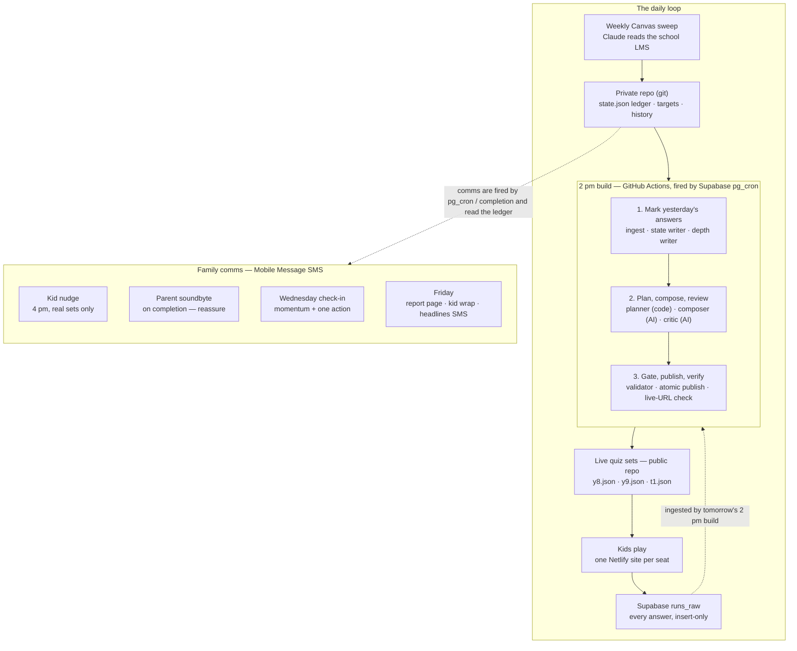

# SYSTEM-MAP.md — XP Daily, end to end

**What this is:** the complete map of the machine, from the weekly Canvas sweep to the Friday
parent report. Written in plain English, with the precise file/table/tool names in brackets so
a QA process can point at real things. This document is the intended input for the QA skill.

**How to read it:** anything marked **[VERIFY]** is a detail that should be confirmed against
the live repo/Supabase before the QA skill treats it as truth. Everything else is ratified
doctrine or was confirmed working in a build session.

**Safe to commit to the public content repo:** no student names, no numbers, no keys, no school
identifiers. Seats are referred to by their codes: **y8**, **y9**, and **t1** (the adult test
seat — the dogfood seat; nothing ships to the kids' seats until proven on t1 first).

*Version 1.1 — 24 Aug 2026 — at-a-glance diagram added; verified against the live content repo (five [VERIFY] items closed; comms triggers, watchdog, and set shapes confirmed).*

---

## 1. The whole machine in one paragraph

Once a week, a Claude session sweeps the boys' school Canvas and writes down what each subject
is actually covering — that becomes the **menu** (the targets file). Every school day at 2 PM
Sydney time, an automated pipeline wakes up on GitHub's computers. It first marks last night's
homework: it pulls in yesterday's quiz answers from the results database, moves each topic's
confidence box, and grades depth of understanding. Then, with the ledger freshly updated, it
plans tonight's quiz from the menu and the ledger, has an AI write the questions, has a second
stronger AI critique them, runs a hard rules check, and publishes the three quiz sets live —
verifying against the live URLs that what's up is what it just wrote. At 4 PM the kids get a
nudge text. In the evening they play on their own Netlify site; every answer is posted straight
into the Supabase results database. The moment a run is completed, the parent gets a reassuring
one-line soundbyte. On Wednesday a scheduled check-in text reads the week's momentum and hands
the parent one small action. On Friday, the system builds two hosted pages — the parent's weekly
report and the kid's game-styled wrap — and texts the parent three headlines with the link. Then
the loop starts again.

**At a glance** (GitHub renders this diagram inline):

---

## 2. The cast (every system involved, one line each)

| System | Role in plain English |
|---|---|
| **Canvas (school LMS)** | The upstream source. Read-only — we never write to it. |
| **Claude (Cowork session)** | Does the weekly Canvas sweep and all build/maintenance work. Human-in-the-loop. |
| **GitHub — public repo `Rich898/DailyXP-content`** | The code and the live quiz files. Generic only: no names, no scores, no secrets. |
| **GitHub — private repo `Rich898/DailyXP-private`** | The kids' data: the mastery ledger, targets, run history, completion record, handoffs. |
| **GitHub Actions** | The computer the pipeline runs on (workflows in the content repo). |
| **Supabase (project `xpdaily`)** | Two jobs: the results database (every answer) and the scheduler (pg_cron) that fires the workflows. Own separate account, Sydney region, Pro tier — deliberately isolated from VitalYOU for Privacy Act separation. |
| **Anthropic API** | The language layer only: writes questions (composer), critiques them (review), grades teach-backs. Never holds state. |
| **Netlify** | Static hosting. One quiz site per seat (y8 / y9 / t1), plus the hosted Friday parent report and kid wrap pages. |
| **Mobile Message** | The SMS pipe for every text: kid nudge, parent soundbyte, Wednesday check-in, Friday headlines. Per-family number routing. |

What deliberately holds **no** state anywhere: the LLMs. They read language in, write language
out. All state lives in git and Supabase.

---

## 3. The daily loop, stage by stage

### Stage A — The 2 PM build (one workflow, seven steps in strict order)

**Runs on:** GitHub Actions (`.github/workflows/daily-quiz.yml` → `scripts/run_daily.py`).
**Triggered by:** Supabase pg_cron. A job ticks every minute, compares Sydney wall-clock time
against the schedule table (`xp_schedule`), and when a slot matches it fires a GitHub
`workflow_dispatch` over `pg_net`, deduped per local day and logged to `xp_dispatch_log`.
GitHub's own cron stays enabled as a true backup: it fires at 04:00 UTC with `--skip-if-published` — a per-student no-op when the 2 pm primary already published, a genuine retry when it failed or HELD (as a primary it was dropping runs; the reason for the cutover). DST is handled because the comparison is against Sydney local time, not UTC.

The seven steps, in plain English:

1. **Ingest — mark yesterday's homework.** Pulls every answer the kids posted last night from
   Supabase (`runs_raw`) and rebuilds the run record (`work/runs.json`, private repo). Ingest
   regenerates that file wholesale, so a **grade carry-forward** mechanism re-attaches
   teach-back grades that would otherwise be wiped (the class of bug that once ate Friday's
   grades on Monday). Ingest source is controlled by `INGEST_SOURCE` (now `supabase`; the old
   Google Sheet path is retired **[VERIFY the Sheet, Apps Script and Google secrets were
   actually deleted, not just switched off]**).
2. **State writer — move the confidence boxes.** Deterministic code (`state_writer.py`)
   applies the spaced-repetition box moves per topic to the ledger. No AI involved.
3. **Depth writer — grade understanding.** Live via the `DAILYXP_DEPTH_LIVE=1` flag. Grades
   clean correct answers against the SOLO ladder and mirrors depth + evidence onto the ledger.
   Ceilings are enforced in code: speed answers can only ever evidence *knows it*, steady
   answers *can list it*, teach-backs up to *can connect it*; *can apply it* is unreachable
   until transfer-tagged questions exist (deliberate under-claiming, not a gap).
4. **Planner — choose tonight's slots.** Deterministic code (`tools/planner.py`). Reads the
   newest targets file (auto-picked; a stale sweep triggers a loud warning, never a silent
   fail), the ledger, and the day directive. Fills this-week-first from the latest sweep, then
   prior weeks. FROZEN seats → empty set. REPAIR slots guaranteed. Assessment-aware. Boss-day
   shaping on Fridays (built from that student's own ledger weaknesses). One steady slot per
   run reserved as a **throwback** (`tools/throwback.py`) — an aged-mastered topic as a
   retention check. Question formats rotate daily from the six-format MC family
   (`tools/formats.py`), seeded per student+date, with calculation topics restricted to
   numeric-safe formats. All four interaction mechanics (swipe, numeric, ordering, short-text)
   are live for all seats.
5. **Composer — write the questions.** The first AI step (`tools/compose.py`, Anthropic API).
   Writes language against exactly the slots the planner chose — never picks topics itself.
   It is handed every prompt the student has ever been served, so it doesn't write repeats.
   Source fidelity ladder: verbatim classroom content > sweep-level structure > syllabus
   knowledge.
6. **Review — the second-pass critic.** A stronger model (`tools/review.py`, Opus) checks for
   meaning-level faults the rules can't see: multiple-true distractors, false "why"
   explanations, off-syllabus content, trivially easy items. A deterministic **answer-length
   gate** (`tools/answer_length.py`) overrides the AI verdict as a hard block (built after
   measuring the correct answer was the longest option ~70% of the time). Flagged slots are
   recomposed and re-reviewed; still failing after 2 rounds → **HOLD**: yesterday's set stays
   live rather than shipping a bad one. Emergency bypass exists (`DAILYXP_SKIP_REVIEW=1`).
7. **Validate and publish — the gate and the safe path.** `tools/validate.py` is the publish
   gate: structure, every question carries its correct answer, and a normalised no-repeat
   hard-block (cosmetic rewording doesn't sneak past). `tools/publish.py` then does an atomic
   validate → write → archive → commit → **VERIFY**: it fetches the live raw GitHub URLs and
   confirms what's live is byte-for-byte what it just published (this killed the
   silent-stale-overwrite bug class from early August). Every published set is archived into
   the private repo's history folder.

**Reads:** `runs_raw` (Supabase), `work/state.json` + `targets/` + history (private repo),
doctrine/config (public repo). **Writes:** updated ledger and run record (private repo,
auto-committed), live quiz sets `y8.json` / `y9.json` / `t1.json` (public repo), history
archive (private repo), completion record entries with the status vocabulary
**DONE / DONE-LATE+n / MISSED / NOT-PUBLISHED / ABSENT**.

### Stage B — Delivery and play (afternoon/evening)

- **4 PM kid nudge** (`tools/kid_nudge.py`, fired on schedule via pg_cron → workflow): a text
  to each kid that tonight's run is up — correctly **suppressed** for any seat whose live set
  is still a placeholder. Rich also receives an operator confirmation SMS when the day
  published cleanly.
- **The kids play** on their own Netlify site. The site is a static, self-contained shell
  (`shell/template_v3.html`, stamped per seat with `__NAME__` / `__STUDENT__` at deploy) that
  loads that seat's live quiz JSON from the public repo. Weekly skeleton is constant: Mon–Fri runs, mid-week event slot, Friday boss slot, weekends off. Set shapes are fixed per day and countable by QA: Mon–Thu = 12 speed + 6 steady + 1 teach-back (19 questions); Friday BATTLEGROUND = 2 speed + 7 steady + 1 teach-back (10).
- **Every answer is captured**: the shell posts results into Supabase `runs_raw`
  (insert-only for the public key via row-level security; fire-and-forget so a network blip
  never blocks play). This is the only door results come in through. One more AI call lives in the play path: teach-backs get live in-quiz feedback from a Supabase Edge Function (`grade-teachback`) — the authoritative depth grade still comes only from the nightly grader, and a ratified roadmap debt says commit the function's source to the repo and strip depth from its response.

**Important operational fact for QA:** the quiz *shell* itself currently reaches Netlify by
manual zip drag-and-drop when the shell changes (the nightly quiz *content* updates via the
repo without redeploys). That manual hop is a known scale gap — see §9.

### Stage C — Completion comms (evening)

- **Daily parent soundbyte** (`tools/soundbyte.py`) — completion-triggered. Job = *reassure*.
  Carries did-it + XP + verdict only. Under the **no-ammunition law** it never carries misses,
  gaps, or anything interrogable. Trigger confirmed: a scheduled completion poll — the workflow runs on polling slots with a cursor so each completion is texted exactly once, and the 21:50 watchdog rung checks the poll ran.

---

## 4. The weekly overlays

### The Canvas sweep (the menu) — weekly, AUTOMATED (promoted 31 Aug 2026)

The scheduled sweep (`sweep-shadow.yml`, pg_cron 07:07 Monday) pulls each boy's live Canvas
courses via his own API token (per `SWEEP.md`) — pages, modules, homepages and announcements —
and produces the per-student, per-subject outline: current topics, key concepts/skills,
assessment dates, and what's new vs last week. Behind the validator gate that becomes the
newest **targets file** (`targets/`, private repo); FAIL = HOLD. Promoted on Rich's GO after
the B6 head-to-head (106/106 adjudicated vs the final manual sweep). The human residue is
docx alerts, rotation overrides, and a changelog eyeball; the manual Chrome-panel drill is
the outage fallback. Every topic that appears live in a sweep is **seeded into the
ledger**, and the seeded state is written back to disk so results on brand-new topics count
(the vanishing-seed bug from the 20 Aug audit is fixed and verified). Doctrine: **SEASONS
LAW 6** — the sweep provides the outline only; the composer generates substance on demand;
the ledger ranks but never caps. By design, Monday's quiz never depends on the weekend sweep,
and a forgotten sweep degrades loudly (staleness warning), never silently.

### Wednesday check-in — scheduled

`tools/wed_checkin.py`. Job = *activate*: a momentum read plus one praise script and one
~5-minute help action, planted so Friday can pay it off. The momentum verdict comes from the
shared **week-word engine** (`momentum(now, prev)`) — code picks the word
(Strong / Solid / Quiet / Slower, with *quiet outranking slower*) from thresholds; the AI only
dresses it in sentences. Wednesday has a no-digits rule (numbers are allowed on Friday).

### Friday — the judge (three surfaces, one job)

Run by the Friday workflow (`friday-report.yml` → `friday_report_run.py`). Build order is
deliberate: **kid wrap deploys before the parent page**, so the parent's link is never a 404;
wrap failure is non-blocking to the parent report.

1. **Parent report page** — hosted HTML on Netlify, per-kid unguessable URL (login wall is
   deliberately deferred until a second family joins). Structure: hero line (standing +
   trajectory fused) · the code-picked week-word · the three axis rows · the win (powered by
   real achievements) · what's-next · assessment-readiness when a test is near · the one
   action · a compact where-he-stands snapshot. Gaps are shown (that's the paying-parent
   value) but framed as a position on a red-to-green scale, and a flagged area always arrives
   *with* its fix. Comparisons are overall-weekly, not per-subject (a week is too few
   questions per subject to trend honestly). Week 1 drops trajectory by design. Wednesday and
   Friday share the same week-word thresholds so they can never contradict each other.
2. **Kid weekly wrap** (`tools/kid_wrap.py`) — hosted, player-card style, fellow-player tone.
   Transparency parity with the parent page is enforced, a banned-language validator runs on
   the copy, and story cards are deduplicated so a topic can't be both "TAKEN DOWN" and "ON
   YOUR TAIL" on the same page. The parent-only integrity note is never passed to the kid
   renderer by construction. (The kid-wrap depth stamp is paused pending depth calibration.)
3. **Friday parent SMS** — the only pushed surface: lead line + three headlines + the report
   link. Friday carries **two** parent texts on different clocks: the on-completion soundbyte
   and the scheduled report.

**Status note:** depth (the SOLO ladder) is being *recorded* nightly but not yet *shown* on
any family-facing surface — the reporting gate is deliberately closed until planner targeting
ships. The weekly "deal card" mechanic is designed and mocked in the ratified visual language
but **not yet integrated [VERIFY current status]**. Visual language for all family surfaces:
navy `#101B2D`, Space Grotesk body, Space Mono data labels, Archivo Black week-word.

---

## 5. Where every piece of data lives (the data map)

| Data | Where it lives | Plain English |
|---|---|---|
| **The mastery ledger** (per topic, per seat: confidence box-state + SOLO depth + evidence) | `work/state.json`, **private repo** | The core IP. The brain. Written only by the deterministic writers; auto-committed by the pipeline. The ledger stays in git, not Supabase — that's a ratified decision. |
| **The menu / targets** | `targets/` files, **private repo** | What school is covering right now, from the weekly sweep. Pipeline auto-picks the newest. |
| **Run record** | `work/runs.json`, **private repo** | The processed view of every night's answers, rebuilt by ingest with grade carry-forward. |
| **Raw results** | Supabase table `runs_raw` | Every answer as posted from the quiz shell, insert-only from the public key. The door results come in through. |
| **Completion record** | `schedule.json` + `SCHEDULE.md`, **private repo** | The permanent per-night status per seat: DONE / DONE-LATE+n / MISSED / NOT-PUBLISHED / ABSENT. |
| **Question history** | history folder, **private repo** | Every prompt ever served, powering the three-layer no-repeat guarantee. |
| **Seat registry** | `roster.json`, **public repo** | Who exists — codes only by law: active flag, tag initial, `targets_alias` for test seats, each seat's permanent play URL. Names never here; kid/parent numbers live only in Actions secrets (`MOBILE_MESSAGE_TO_<CODE>`, `MOBILE_MESSAGE_PARENTS_<CODE>`); seat-holder names (no numbers) in private `COMMS-SEATS.md`. |
| **Per-run plans** | `plans/<seat>/<date>.json`, **private repo** | The planner's persisted question→topic join for each run — how the state writer knows which topic each answer belongs to. |
| **Live quiz sets** | `y8.json` / `y9.json` / `t1.json`, **public repo** | Tonight's actual quizzes, fetched by the shells. |
| **The shells / hosted pages** | Netlify (3 quiz sites + report + wrap pages) | What the family actually touches. |
| **Schedule + dispatch log** | Supabase `xp_schedule` (18 slots: `sweep-0707-mon`, `daily-quiz`, `kid-nudge`, `soundbyte-1/2/3`, `wed-checkin-early/-cutoff`, `friday-report-2035/-2105/-2145/-0730-sat`, `watchdog-early/-late/-friday`, `portal-monday/-friday/-saturday`), `xp_dispatch_log` | The clock and its receipt trail. |
| **Doctrine & specs** | **public repo**: `SEASONS.md`, `REPORTING.md`, `UNDERSTANDING.md`, `CONTENT-MODEL.md`, `EXAM-MODE.md`, `QUIZ-GENERATION.md`, `DAILY-PUBLISHING.md`, `SWEEP.md`, `ROADMAP.md`, `LEDGER-RULES.md`, `ONBOARDING.md`, `RUNBOOK.md` | The written law. The QA skill should treat these as the spec of record. |
| **Secrets** | GitHub Actions secrets (content repo) + Supabase keys | Anthropic key, `DAILYXP_TOKEN` (fine-grained PAT scoped to both repos), Netlify secrets, Supabase `sb_publishable` / `sb_secret` (apikey header, not Bearer). Never in code; the public repo is grep-guarded for names/scores/secrets before pushes. |
| **What holds no state** | The LLMs | By law. If it matters tomorrow, it's in git or Supabase tonight. |

---

## 6. What triggers what (the trigger map)

| When (Sydney time) | Fired by | What runs |
|---|---|---|
| Weekly (Mon 07:07, pg_cron `sweep-0707-mon`; guarded GitHub backup 08:07) | Automated Canvas sweep (`sweep-shadow.yml`, promoted 31 Aug via B6) | Fetch → summarise → validate → PROMOTED `targets/<monday>.json` → topic seeding; human = docx alerts + rotation overrides |
| School days ~2:00 PM | pg_cron → `workflow_dispatch` | The 7-step build: ingest → state → depth → plan → compose → review → validate/publish |
| School days ~4:00 PM | pg_cron → `workflow_dispatch` | Kid nudge SMS (suppressed for placeholder seats) + operator confirmation |
| Evenings 18:30 / 20:00 / 21:30 (cursor) | pg_cron → `workflow_dispatch` (GitHub cron backup) | Parent daily soundbyte — each completion texted once |
| Wed 18:25 + 20:25 AEST | pg_cron → `workflow_dispatch` (GitHub cron backup) | Wednesday check-in SMS (18:25 poll + 20:25 cutoff) |
| Fri 20:35 / 21:05 / 21:45 + Sat 07:30 AEST | pg_cron → `friday-report.yml` (GitHub cron backup), cursor-deduped | Kid wrap deploy → parent report page deploy → Friday parent SMS; the four-rung ladder retries a dropped or 401'd first fire |
| 17:35 + 21:50 school days, 22:05 Fri | pg_cron → `watchdog.yml` (GitHub cron backup) | Watchdog — verifies each comms rung actually fired |
| Weekly, incl. holidays (two cron slots + manual dispatch) | GitHub's own cron (`heartbeat.yml`) | Supabase keep-alive poke — confirmed present and armed; Pro tier makes it belt-and-braces |
| Backup — 04:00 UTC daily | GitHub Actions cron with `--skip-if-published` | Re-runs the daily build; no-op if the primary published, real retry on failure or HOLD |

---

## 7. The laws (the invariants QA must enforce, not just observe)

These are ratified doctrine. A QA run that finds all files present but one of these violated
has found a **failure**, not a pass.

1. **LLMs never hold state.** All state in git + Supabase. LLM output is always re-derivable.
2. **Code decides, language dresses.** Every family-facing verdict (week-word, standing,
   thresholds, headlines) is computed by code; the AI only phrases it.
3. **Two-axis separation.** The confidence/box axis and the SOLO depth axis never read each
   other. Enforced in code.
4. **The teach-back grader is the sole depth instrument.** Depth is never seeded from school
   reports; depth ceilings by answer type are enforced (speed→knows, steady→lists,
   teach-back→connects; applies unreachable until transfer-tagged questions exist).
5. **SEASONS LAW 6.** Sweep = outline only. Composer generates on demand. Ledger ranks,
   never caps.
6. **No-ammunition law.** The soundbyte carries nothing interrogable; a flagged area on any
   surface always arrives with its fix; under-claim when data is thin; quiet outranks slower.
7. **No-repeat, three layers.** Composer sees full history; validator hard-blocks normalised
   repeats at compose *and* publish; every published set is archived.
8. **Atomic publish with live verification.** Nothing counts as published until the live URL
   matches what was written. HOLD (yesterday's set) beats shipping a bad set.
9. **Weekly skeleton constant.** Mon–Fri runs, mid-week event slot, Friday boss (built from
   that student's own ledger), weekends off. Reversed questions cap at *knows it* and never
   evidence the top SOLO rung.
10. **t1 first.** No new mechanic or shell change reaches y8/y9 before it has run clean on t1.
11. **Two-repo privacy law.** Public repo: generic code only — no names, scores, or secrets
    (grep-guard before push). All kid data in the private repo. Supabase fully separate from
    VitalYOU.
12. **Compete with past self only.** No sibling comparison anywhere; badges are honest by
    construction because they read real mastery.

---

## 8. QA checkpoints (the seed of the QA skill)

At every checkpoint the QA run asks two questions: **did it happen** (artifact exists, on
time, well-formed) and **did it obey the laws** (§7). Observable proofs, stage by stage:

**Sweep:** newest targets file exists and is dated this week; per-student per-subject sections
present with assessment dates; every live topic in the sweep now exists in the ledger
(seeding proof); staleness warning fires if the file is old.

**Build:** `xp_dispatch_log` shows today's 2 PM dispatch; the Actions run is green; a live set
exists for every active seat and is not a placeholder; live raw URL content matches the repo
commit (publish VERIFY); every question carries its answer; no question repeats history
(normalised); slot mix matches the day directive and chapter loadout; Friday's set contains a
boss built from that seat's ledger; throwback slot present; correct-answer length shows no
exploitable bias; review gate log shows pass/recompose/HOLD as designed; ledger and runs.json
committed to the private repo with today's date.

**Delivery & play:** nudge sent at 4 PM to seats with real sets and suppressed for
placeholders; shell loads with zero JS errors; a completed t1 run produces rows in `runs_raw`
for the correct seat and date across all four mechanics.

**Scoring (checked in the next day's build):** box moves follow the deterministic algorithm
for known inputs; depth moves only exist where a grading event exists, and never exceed the
ceiling for their answer type; no cross-axis reads; completion record status is correct
(DONE / MISSED / etc.); teach-back grades survive re-ingest (carry-forward proof).

**Comms:** soundbyte sent only on completion, containing only reassure-class content (a
no-ammunition content lint); Wednesday and Friday sends match `xp_schedule` and per-family
config; Wednesday's week-word and Friday's week-word cannot contradict (same engine, shared
thresholds — testable); Friday report page renders this week's units, and its numbers
reconcile with the ledger and run record; kid wrap passes the banned-language validator and
transparency parity; kid wrap deployed before the parent page; the SMS link resolves (no 404);
Mobile Message shows delivered (beware the dashboard rendering AEDT — a "5 PM" display for a
4 PM send is the known timezone display quirk, not a late send).

**The golden thread (the single best end-to-end test):** pick one topic from the newest sweep
and follow it the whole way — it appears in the targets file → it is seeded in `state.json` →
the planner selects it → a question about it exists in tonight's live JSON → an answer to it
lands in `runs_raw` → the next build moves its box in the ledger → it is reflected on Friday's
surfaces. One thread, every subsystem. Run it on t1 so it never touches the boys' data.

**Historical failure classes QA should regression-test forever** (each has actually
happened): silent stale overwrite of a live set (killed by atomic VERIFY); dropped scheduler
triggers (killed by pg_cron; check dispatch log vs schedule); ingest wiping teach-back grades
(killed by carry-forward); gitignore rules silently disabled by inline comments (privacy
guard); answer-length giveaway bias; the SMS last-hop failure (platform delivered ≠ handset
received); placeholder set going out with a nudge.

---

## 9. Honest scale notes (what's manual today that beta will expose)

You asked for everything to be built toward high scale — these are the current human hops the
QA skill should watch, because each one becomes a bottleneck or a silent-failure risk at ten
families:

1. **The sweep is automated as of 31 Aug 2026** (B6 promotion) — cadence is no longer a
   person's calendar. The residual scaling constraint is per-school onboarding (student
   tokens, subject dialects, rotation overrides) and the human docx/edge-case layer; holiday
   gaps stay covered by the Monday-independent design.
2. **Shell deploys are manual zip drag-and-drop** to three Netlify sites. Fine at three seats;
   error-prone at thirty. (Nightly content needs no redeploy — this is only when the shell
   changes — but it's the kind of step that gets skipped for one seat and drifts.)
3. **Per-family config** (touchpoint on/off, numbers, seats) grows linearly — the config split is now confirmed — `roster.json` (codes + play URLs, public) with numbers in per-seat Actions secrets and matching env lines in three comms workflows. At ten households that secrets-plus-env-lines hop is the error-prone step to script first. ONBOARDING.md's own ratified law applies: the URL is currently the identity — acceptable for family, a hard gate (kid codes/auth) the moment a non-family child joins.
4. **The commercialisation gate is already documented** in the ledger of obligations
   (Privacy Act 1988 / 13 APPs): the moment a second, non-family child enters, informed
   consent, exportable/correctable ledgers, breach notification, retention/deletion, and AU
   data residency all activate. The Supabase account separation and two-repo law were early
   moves for exactly this.

---

## 10. Consolidated [VERIFY] list — close these before the QA skill is built

Five items were closed against the live repo on 24 Aug (soundbyte trigger, heartbeat status,
completion-record path, routing/config location, backup-cron status). Still open — each is one
grep or one SQL query in a hands-on session:

1. ~~Exact current `xp_schedule` slot inventory in Supabase.~~ **RESOLVED 29 Aug** (W1):
   14 slots — `daily-quiz` 14:00, `kid-nudge` 16:00, `soundbyte-1/2/3` 18:30/20:00/21:30,
   `wed-checkin-early/-cutoff` 18:25/20:25, `friday-report-2035/-2105/-2145` 20:35/21:05/21:45
   + `friday-report-0730-sat` Sat 07:30, `watchdog-early/-late/-friday` 17:35/21:50/22:05.
2. Whether the Google Sheets exit fully completed (Sheet, Apps Script deployments, and the
   two Google secrets deleted from Actions).
3. Where achievement/badge state is persisted (ledger vs. run record vs. elsewhere).
4. Deal-card mechanic integration status.
5. Current status of the parent cumulative portal ("Full Picture") vs. the weekly report —
   built, gated, or pending planner targeting.

Recommend closing the list in the same session the QA skill is scaffolded, so the skill is
born against verified truth.
