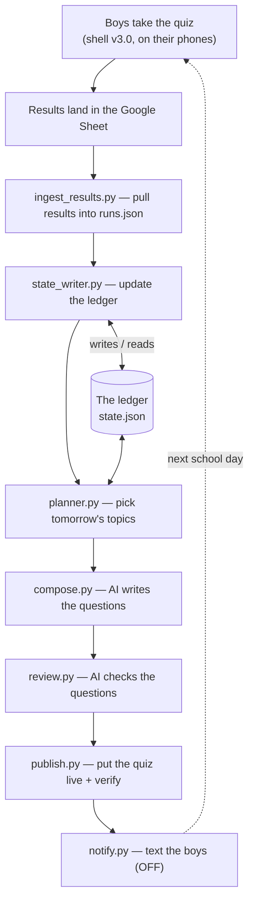

# DailyXP — system map (plain-English overview)

What this project is, how the whole thing fits together, and — clearly — **what is built and
what isn't yet**. Written to be readable without knowing the code. For the deep detail on any
piece, follow the links to `tools/README.md`, `scripts/README.md`, and the doctrine docs.

---

## The one big idea

Every school night the system quietly does what a tutor would do: it reads how the boys went
on last night's quiz, updates a private record of **what each boy has and hasn't mastered**,
and uses that to build tomorrow's quiz — harder on weak spots, spaced-out on strong ones.

The record of mastery — the **ledger** (`state.json`) — is the actual product. Everything
else is machinery that keeps it accurate and turns it into a quiz. Two rules hold the design
together:

1. **The ledger is the brain.** Plain, predictable code owns it — no AI decides whether a
   topic is "mastered." That keeps it fair, inspectable, and editable by hand.
2. **AI only does language.** Writing questions and checking questions are the only jobs
   handed to the AI. It never keeps score and never decides what to teach next.

---

## The nightly loop (the whole thing, end to end)

---

## What happens each night — step by step

1. **The boys take their quiz.** They open a web page (the "shell") on their phones. It shows
   the questions, times each answer, asks "how sure are you?" on the harder ones, and quietly
   flags things like a rushed wrong answer or a confident wrong answer. When they finish, it
   sends the whole run to a Google Sheet.

2. **The job wakes up** (a GitHub Actions run). Right now it's started by a button click; it
   *can* be put on a timer.

3. **Ingest** (`ingest_results.py`). The job fetches the Sheet's rows through a locked,
   read-only web address, throws away test rows and accidental duplicates, and writes the clean
   results into `runs.json`.

4. **Update the ledger** (`state_writer.py`). It reads last night's results and moves each
   topic in the ledger — up for a calm, confident, correct answer; down for a genuine miss;
   into a "REPAIR" lane for a chronic weakness; and — importantly — it does *not* punish a
   rushed slip as if it were a gap. The rules are written out in `LEDGER-RULES.md`. It never
   overwrites the human notes.

5. **Plan tomorrow** (`planner.py`). Reading the freshly-updated ledger plus what's currently
   being taught in class, it decides which topics get a slot tomorrow and in what shape.

6. **Write the questions** (`compose.py`). The plan goes to the AI, which writes the actual
   questions for each slot.

7. **Check the questions** (`review.py`). A second, stronger AI re-reads every question looking
   for the kinds of mistakes a simple checker can't catch — two right answers, a factual error,
   something off-syllabus. If it finds a serious one, that slot is rewritten and re-checked; if
   it still can't pass, the quiz is held and yesterday's stays up.

8. **Publish** (`publish.py`). The approved quiz is written to the live files the boys' page
   reads, and the job confirms the live page actually updated before calling it done.

9. **(Notify)** (`notify.py`). This would text the boys "your quiz is up." It's built but
   **switched off** until the SMS account is set up.

10. **Next school day, the loop repeats** — now shaped by how they did.

---

## The tools, one by one

**The nightly loop**
- `ingest_results.py` — pulls results from the Google Sheet into `runs.json`. *(New.)*
- `results_reader.py` — the rulebook that reads each answer and labels it (confident-wrong,
  rushed-wrong, lucky guess, calm correct, and so on). Used by both the writer and ingest.
- `state_writer.py` — applies those labels to the ledger: promotions, demotions, REPAIR in and
  out. Deterministic, no AI. *(New.)*
- `planner.py` — picks tomorrow's topics and slot shapes from the ledger + what's live in class.
- `compose.py` — hands the plan to the AI to write the questions.
- `review.py` — a stronger AI double-checks the questions before they can go live.
- `validate.py` — a basic safety gate (right answer is actually one of the options, no repeats).
- `publish.py` — writes the quiz live and verifies the live page updated.
- `notify.py` — SMS out (built; off until the SMS account is live).

**Runs the whole sequence**
- `scripts/run_daily.py` — the conductor: runs ingest → update ledger → plan → compose → review
  → publish in order, for both boys.
- `.github/workflows/daily-quiz.yml` — the GitHub job that runs the conductor and saves results
  back. Currently manual-start; the timer is written but commented out.

**The quiz the boys see**
- `shell/template_v3.html` — the quiz page itself (version 3.0, live).

**The rules and plans (documentation)**
- `LEDGER-RULES.md` — how a night's result moves a topic (the promotion logic).
- `CONTENT-MODEL.md` — how class content maps to masterable topics.
- `SEASONS.md`, `REPORTING.md`, `ABSENCE.md`, `SWEEP.md`, `RUNBOOK.md`, `ROADMAP.md`,
  `SHELL-3.1-SPEC.md` — the season structure, the parent-reporting plan, the sickness rule, the
  Canvas-sweep process, the operating runbook, the roadmap, and the next shell's spec.

**Where things live**
- **Public repo** (`DailyXP-content`) — all the code above and the doctrine. No names, no scores.
- **Private repo** (`DailyXP-private`) — the data: the ledger (`state.json`), results
  (`runs.json`), the per-run plans, the human mastery ledgers, targets, and the completion record.

---

## Built vs not built — where things actually stand

### ✅ Built and live (working now)
- The quiz shell (v3.0) the boys use, capturing answers, timing, confidence, and flags.
- The Google Sheet + the read-only ingestion endpoint (tested end to end).
- **The full nightly pipeline**: ingest → update ledger → plan → compose (AI) → review (AI) →
  publish. Proven green in a real dry-run, and the ingest + ledger steps confirmed against live
  results.
- The safety gates (validate + the stronger-AI review) and the atomic, self-verifying publish.
- The per-run plan persistence that lets results map back to the right topic.
- Regression tests for the ledger rules.

### 🔶 Built, but switched off / not yet wired
- **The daily timer (cron).** The pipeline runs on a button click today. Putting it on an
  automatic 2pm schedule is one uncomment away — deliberately left as your decision.
- **SMS (`notify.py`).** Built, but no messages send until a Mobile Message account, a branded
  sender (ABN + ACMA registration), and the recipients' numbers are set up.

### 📋 Designed, not yet built
- **Parent reports** — the daily reassurance text, the Wednesday check-in, the Friday summary.
  The plan is written (`REPORTING.md`) and the SMS pipe exists, but the piece that *writes* those
  messages isn't built yet.
- **Seasons / chapters as a driver** — the game-season structure is specced (`SEASONS.md`) and
  the planner already handles special "Boss" days, but the full season engine isn't built.
- **Automatic Canvas reading** — pulling class content automatically. Today it's a manual weekly
  sweep (`SWEEP.md`); automating it needs per-student Canvas access tokens.
- **Shell v3.1** — typed answers, drag-to-order, a Friday "Boss", and a few robustness fixes.
  Specced (`SHELL-3.1-SPEC.md`); build session booked.

### 🧭 Future (for turning this into a product)
- Support for more than one family: per-family settings, private kid codes, data-deletion tools.
- The privacy/compliance work that becomes mandatory the moment a second, non-family child is
  added.
- Onboarding and billing.

The single technical item that unlocks the product path is **canonical topic IDs** (a stable ID
per topic shared everywhere). Today the pieces match topics by name, which works for two boys;
IDs are the proper fix and the real moat.

---

## Running it

- **Supervised (now):** GitHub → **Actions** → **daily-quiz** → **Run workflow**. Tick
  *"Plan+compose only"* for a safe rehearsal that publishes nothing; leave it unticked to
  publish today's quiz for real.
- **Hands-off (when you're ready):** uncomment the two `schedule:` lines in the workflow and it
  fires itself on school-day afternoons. The kill-switch is disabling the workflow.

See `RUNBOOK.md` for the operating detail and `scripts/README.md` for the pipeline internals.
